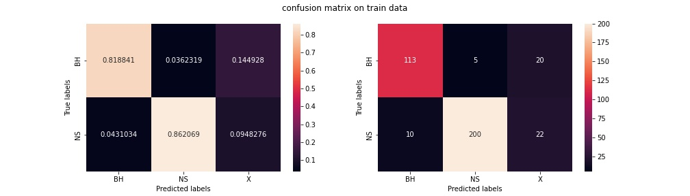
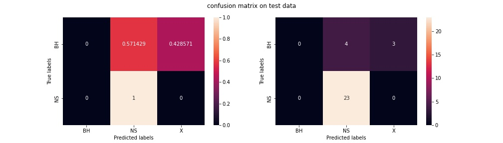
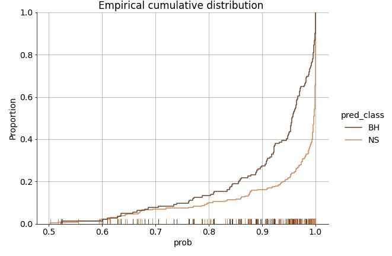
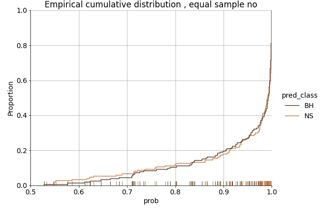
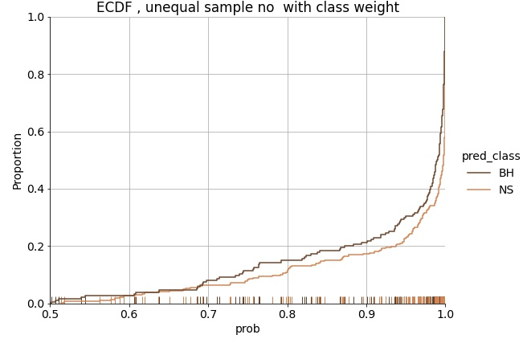
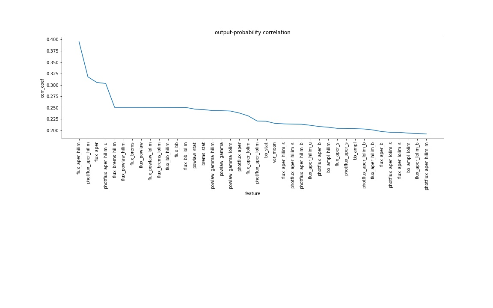
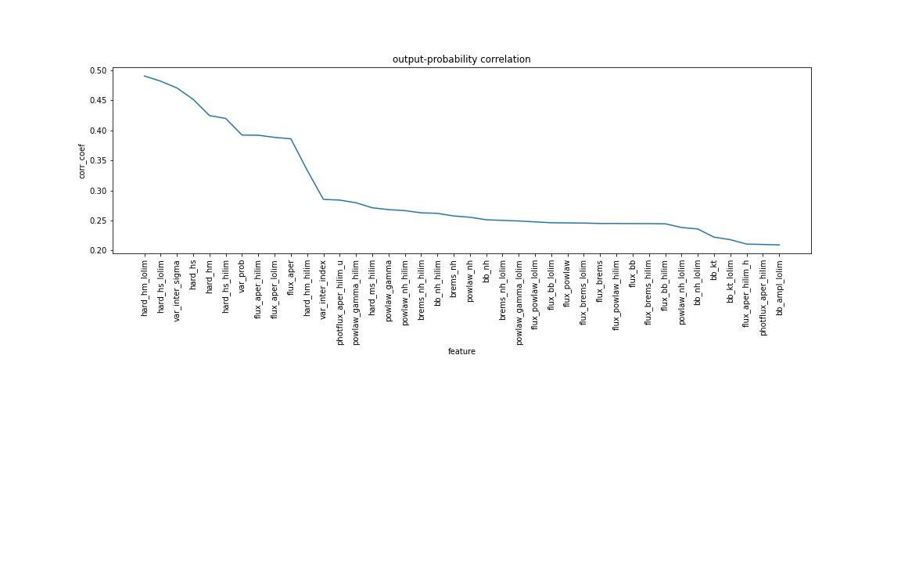
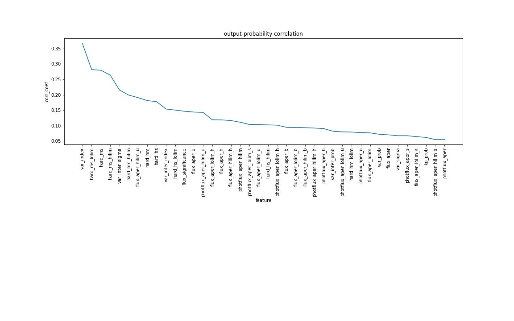

### Recap

* Classification without filtering
* Studied GC to identify only quiscent obs for the sources
* Extracted flux distribution for all chandra GC sources
* Decided threshold (for CV threshold not decided)
* Classified n 3-classes (LMXB NS / LMXB BH / CV )

> Suspected problems with source.

---

## Source Info

Previously selected sources and obs

| #                      | LMXRB BH | LMXRB NS | CV   |
| ---------------------- | -------- | -------- | ---- |
| sources                | 123      | 229      | 322  |
| Observations           | 1100     | 1268     | 3609 |
| Obs matching criterion | 824      | 971      | 2604 |

### Problems

* Several repated sources , different names in diff catalogues
  * Removed repetiotion
* Same source in selected catalogue , cross matched with more than one chandra source within cross-match radius (10 arcsec )
  * Selectd ch sources only with highest cross match.
* No idea , which of them belong to GC

### Corrected dataset

| #                       | LMXRB BH | LMXRB NS | CV   |
| ----------------------- | -------- | -------- | ---- |
| sources                 | 33      | 85      | 115  |
| Observations            | 178     | 457     | -- |
| Obs matching criterion  | 139      | 297      | -- |
| Sources closer than 40' to GC |     1     |    25      |   32   |

## LMXRB BH Sources

|   | Catalogue CODE | Cat Name                                                       |
| - | -------------- | -------------------------------------------------------------- |
| 0 | INTREFCAT      | INTEGRAL Reference Catalog (Ebisawa et al.)  Liu et al. (2001) |
| 1 | NGC3115CXO     |                                                                |
| 2 | RITTERLMXB     |                                                                |
| 3 | SAXWFCCAT      |                                                                |
| 4 | SAXWFCCAT2     |                                                                |
| 5 | WGACAT         |                                                                |
| 6 | XRBCAT         |                                                                |

---
|SL NO|Source Name          |CATALOGUES                                                                                       |RA        |DEC       |confirmation type      |Nearest GC|GC distance|
|-----|---------------------|-------------------------------------------------------------------------------------------------|----------|----------|-----------------------|----------|-----------|
|1    |1A 0620-00           |INTREFCAT(1A 0620-00), RITTERLMXB (V616 MON), XRBCAT(A0620-003)                                  |95.685    |-0.345833 |dynamic                |          |           |
|2    |GINGA 1354-645       |INTREFCAT (GINGA 1354-645) RITTERLMXB(BW CIR) , XRBCAT (CEN X-2)                                 |209.54125 |-64.734722|spectroscopy           |          |           |
|3    |XTE J1550-564        |INTREFCAT(XTE J1550-564) RITTERLMXB(V381 NOR)                                                    |237.74458 |-56.476665|                       |          |           |
|4    |XTE J1650-500        |INTREFCAT (XTE J1650-500) RITTERLMXB(J1650-4957)                                                 |252.504167|-49.9625  |orbital resonance model|          |           |
|5    |GRO J1655-40         |INTREFCAT (GRO J1655-40) XRBCAT(GRO J1655-40) RITTERLMXB (V1033 SCO)                             |253.500417|-39.845833|spectroscopy           |          |           |
|6    |GX 339-4             |INTREFCAT (GX 339-4) RITTERLMXB (V821 ARA) XRBCAT (GX 339-4)                                     |255.70625 |-48.789722|spectroscopy           |          |           |
|7    |IGR J17091-3624      |INTREFCAT                                                                                        |257.281667|-36.406944|spectral modelling     |          |           |
|8    |1E 1740.7-2942       |INTREFCAT(1E 1740.7-2942) XRBCAT (E1740.7-2942) WGACAT (1WGA J1743.9-2944) RITTERLMXB (1740-2943)|265.978333|-29.745278|spectral analysis      |          |           |
|9    |IGR J17464-3213      |INTREFCAT                                                                                        |266.566667|-32.233056|spectroscopy           |          |           |
|10   |GRS 1758-258         |INTREFCAT (GRS 1758-258) RITTERLMXB (1758-2544) WGACAT (1WGA J1801.2-2544) XRBCAT (GR1758-258)   |270.302917|-25.740556|spectroscopy           |Terza-5   |37.9 arcmin|
|11   |SAX J1819.3-2525     |INTREFCAT RITTERLMXB (V4641 SGR)                                                                 |274.84    |-25.406944|dynamic                |          |           |
|12   |XTE J1859+226        |INTREFCAT                                                                                        |284.673333|22.658056 |dynamic                |          |           |
|13   |XTE J1908+094        |INTREFCAT                                                                                        |287.22125 |9.384722  |spectrum               |          |           |
|14   |V518 PER             |RITTERLMXB(V518 PER) XRBCAT (CJ0422+32) WGACAT (1WGA J0421.7+3254)                               |65.428333 |32.9075   |                       |          |           |
|15   |J1047+1234           |RITTERLMXB (J1047+1234)                                                                          |          |          |                       |          |           |
|16   |KV UMA               |RITTERLMXB                                                                                       |169.545417|48.036944 |spectral analysis      |          |           |
|17   |J1242+3232           |RITTERLMXB                                                                                       |190.567083|32.547222 |                       |          |           |
|18   |GS 1354-645          |SAXWFCCAT2                                                                                       |209.495   |-64.733   |dynamic                |          |           |
|19   |4U1630-472           |XRBCAT                                                                                           |248.501358|-47.394083|spectral analysis      |          |           |
|20   |J1659-1515           |RITTERLMXB                                                                                       |254.757083|-15.258056|                       |          |           |
|21   |J1745-2900           |RITTERLMXB                                                                                       |266.416667|-29.008611|                       |          |           |
|22   |SAXWFC J1819.4-2524.0|SAXWFCCAT                                                                                        |274.84125 |-25.400083|spectroscopy           |          |           |
|23   |1WGA J2024.0+3351    |WGACAT (1WGA J2024.0+3351) RITTERLMXB (V404 CYG) XRBCAT (G2023+338)                              |306.015833|33.866556 |spectroscopy           |          |           |

> Total dynamicaly confirmed sources - 4

## LMXRB NS sources

All Subclasses of LMXRB pulsars
All Subclasses of LMXRB Burstars

---

# Classification

> Note- major problem :
> AMbiguous classification included - < 80%>

Sources kept aside for testing :

### Result

### Problems

* Network Performance analysis
  * Bias-variance (very high variance)
  * Accuracy
  * Precision , recall
* Need to decide confidance of our prediction
* Data imbalance Problem

* Ambiguous classification
* Same source : different-obs-different-classification.

### Diagnostics

* Network performance analysis

  * K-fold cross validation
* Confidence level for class , **ECDF** plot
* Feature importance

  * Output probability - feature correlation
* Feature-feature correlation

  * Identify location of miss-classified source

