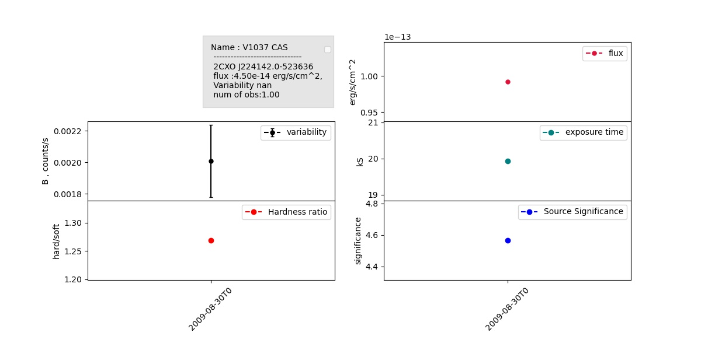
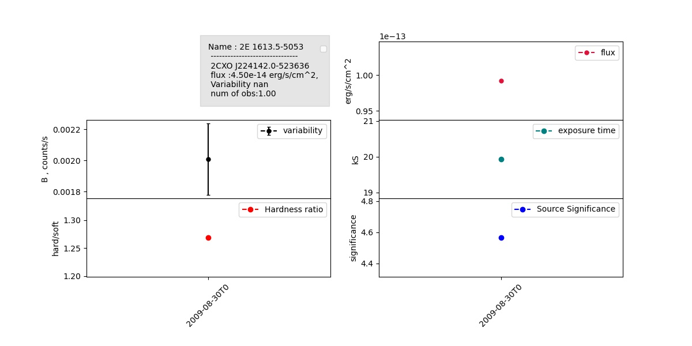
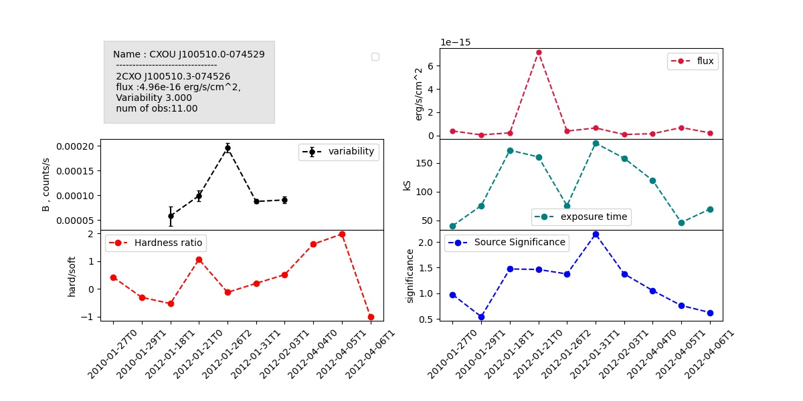
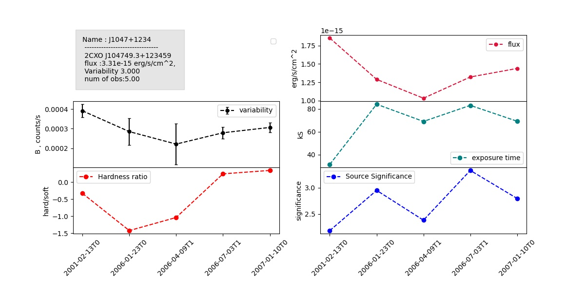

# Source verification 
## Per observation study
---
> Problem : whether the X-ray binary sources we are looking at were in transient state or in quiscent state

> We had to identify the nature of the source at the time we have catalogue data 

### CHANDRA observation schema 
---
Each identified source in chandra catalogue has one **master_source** entry in master table and different observation entries in **per observation detection table**

---
## Data available per observation 
* Observation specific
    * Obs time
    * Exposure time
    * ... 
* Observation Detection 
    * Flux significance

* Aperture Photometry
* Hardness ratios
* Spectral Fits
    * Black body mdoel
    * Powerlaw Model
    * Brmstrlng model
    * APEC Model

* Variability
    * intra observation variability

### Chandra filters 

|-----------|-----------|--------------|-------------|-----------|-----------|-------------|

(0.1)-------(0.2)------(0.5)----------(1.2)---------(2.0)-------(5.0)--------(7.0)--------(10.0)

              -----------------------b------------------------------------------
              ---u---------
                           -------s-----
                                        ------m--------
                                                       ------------h----------
    --------------------------------------------------w--------------------------------------
#### instruments 
> W- HRC

> b,u,s,m,h, - ACIS  

---
### Catalogues used 
* Ritter Low-Mass X-Ray Binaries Catalog (Ritter, Kolb)
* Low-Mass X-Ray Binaries Catalog (Liu et al.)
* NGC 3115 Chandra X-Ray Point Source Catalog (Lin et al.)
* ROSAT PSPC White, Giommi, and Angelini 'Good' Source Catalog

## Example 

## NS

## BH 

