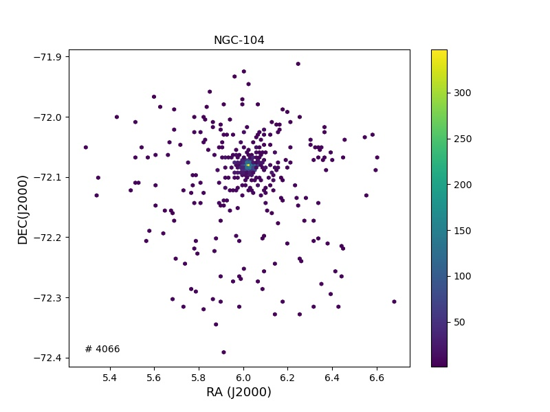
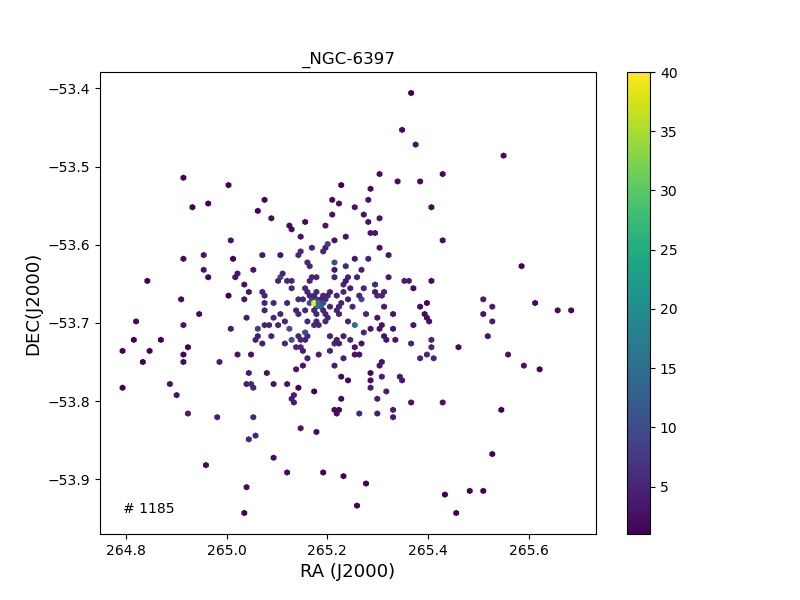
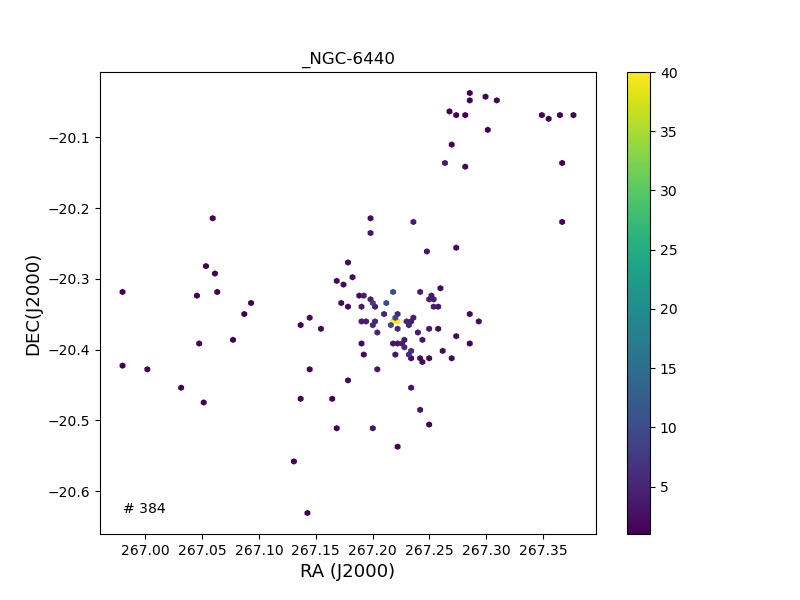
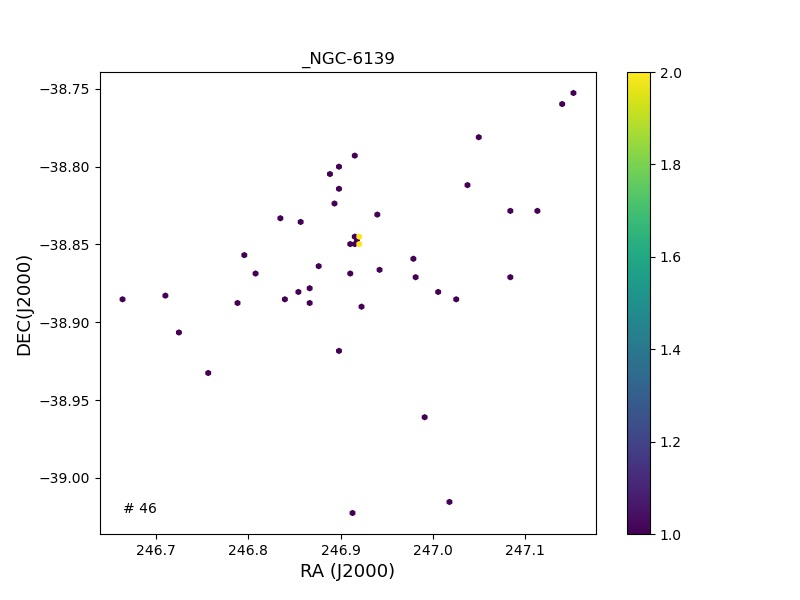
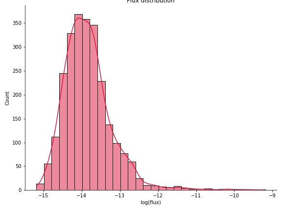
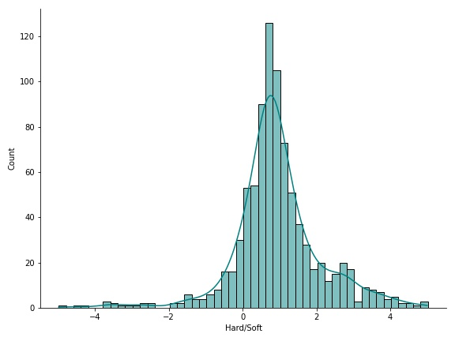

## Recap 

Per observation study
<br><br>
# Globular Cluster Sources 

This exercise is to identify the flux distribution of X-ray sources in Globular clusters. We will use this flux distribution for setting up a threshold for identifying the quiscent observations for our training sample.


## Catalogue 
--- 
 CATALOG OF PARAMETERS FOR MILKY WAY GLOBULAR CLUSTERS:
                           THE DATABASE
Compiled by William E. Harris, McMaster University

https://physics.mcmaster.ca/~harris/mwgc.dat
cite- Harris 1996 (2010 edition)
  
|ID         |RA(2000)     |DEC(2000)   |
|-----------|-------------|------------|
| NGC-104   |00 24 05.67  |-72 04 52.6 |
| NGC-288   |00 52 45.24  |-26 34 57.4 |
| NGC-362   |01 03 14.26  |-70 50 55.6 |
| Whiting_1 |02 02 57     |-03 15 10   |
| NG_1261   |03 12 16.21  |-55 12 58.4 |
| Pal-1     |03 33 20.04  |+79 34 51.8 |
| ... | ...  | ... |
| NGC-7078  |21 29 58.33  |+12 10 01.2 |
| NGC-7089  |21 33 27.02  |-00 49 23.7 |
| NGC-7099  |21 40 22.12  |-23 10 47.5 |
| Pal-12    |21 46 38.84  |-21 15 09.4 |
| Pal-13    |23 06 44.44  |+12 46 19.2 |
| NGC-7492  |23 08 26.63  |-15 36 41.4 |

> Number of Clusters - 91 

> CHANDRA cone search using CIAO centered around each GC position , 20 arcmin
<style>
   
    .img-wrap{
        display:flex;
        flex-wrap:wrap;
    }
    .img-wrap img{
        max-width:500px;
    }
</style>
<div style="display:flex;width:100vw;" class="img-wrap">
    
    
    
    
</div>


--- 
## Data Reduction

> RA, DEC for sources belonging to all the clusters retrived from <b>Chandra Source Catalogue CSC2.0</b>  from <b>Per Observation Table</b>


> Only considered sources which are having unique representation in master catalogue table , which means that the observation is identified to belong to a unique source in CSC2.0 

> Considered source with <b>flux_significance</b> higher than <b>3 sigma</b> level

> Total number of such observations - 2520

> FLux with different bands **h/m/s/u** were added as not all the sources have observations in all the bands 

### FLux Distribution 
--- 

| val | significance | Flux | Lolim | Hilim |
| ------ | ------ | ------ | ------ | ------ | 
count	| 2520.000000 |	2.517000e+03| 	2.517000e+03 |	2.517000e+03
mean| 6.077443 |	6.575527e-13 |	3.540748e-13 |	9.851958e-13
std|	6.184429 |	1.354816e-11 |	8.163666e-12 |	1.925039e-11
min|	3.002000 |	6.501500e-16 |	3.899220e-16 |	8.831000e-16
25%|	3.521500 |	5.519000e-15 |	4.206250e-15 |	7.213750e-15
50%|	4.353000 |	1.209940e-14 |	9.305600e-15 |	1.604744e-14
75%|	6.285500 |	2.874625e-14 |	2.308475e-14 |	3.630580e-14
max	|   116.8620 |	5.660075e-10 |	3.809948e-10 |	7.408198e-10



<br>


> Sources having FLux higher than $10^{-10} erg-cm^2-s$


| cl_name |	obs_name	| flux_aper |
|---------|-------------|-----------|
|GLIMPSE-02.csv |	2CXO J181749.6-164859 |	1.368934e-11|
|GLIMPSE-02.csv	| 2CXO J181811.2-170152 |	2.230244e-11|
|GLIMPSE-02.csv | 2CXO J181837.9-170248 |	5.660075e-10|
|NGC-6760.csv |	2CXO J191134.1+010734 |	4.724889e-11|
|NGC-3201.csv |	2CXO J101809.0-461835	|	1.667615e-11|
|NGC-5139.csv |	2CXO J132730.1-471050 |		7.440413e-11|
|NGC-5139.csv |	2CXO J132734.7-473237 |	6.336993e-11|
|NGC-5139.csv |	2CXO J132734.7-473237 |	1.748099e-10|
|NGC-5927.csv |	2CXO J152712.2-502555 |	2.421206e-11|
|NGC-6293.csv |	2CXO J170930.3-263919 |	6.794100e-11|
|NGC-6304.csv |	2CXO J171355.3-293031 |	1.299440e-10|
|Terzan-2.csv |	2CXO J172733.1-304807 |	1.178764e-11|
|NGC-6362.csv |	2CXO J172951.1-665756 |	2.768267e-10|

--- 
<br>

# Deciding Flux threshold 

Generally 
LMXRB in quiscent state - $L_X\approx 10^{32}erg/s$

LMXRB undergoing bursts have x-ray luminosities $L_X\approx 10^{36} - 10^{38} erg/s$

|Dist \ $L_x$|$10^{36}$|$10^{38}$|
|-------|-------|-------|
| 1kPc | $8.4\times10^{-9}$ |$8.4\times10^{-7}$ |
| 8kPc | $1.3\times10^{-10}$ | $8.4\times10^{-8}$ | 
| 15kPc | $3.7\times10^{-11}$ | $3.7\times10^{-9}$ |  

> 15 kpc - radius of Galactic halo

> 8kpc - center of our galaxy 

> 1kpc distance to nearest GC, M4

<small>
Tucker, M. A., et al. "ASASSN-18ey: the rise of a new black hole X-ray binary." The Astrophysical Journal Letters 867.1 (2018): L9.
</small>


### Hardness Distribution 
---

```
hardness calculation here
```

| Field | significance |	hardness |
|---------|----------|------------|
|count |	960.000000 |	960.000000 |
|mean |	5.877780 |	1.777077 |
|std |	7.052141 |	13.666540 |
|min |	3.004000 |	-239.416667 |
|75% |	6.042750 |	1.628945 |
|max |	116.862000 |	208.166667 | 


 
> Ultra-soft sources [hardness < -20]

|cl_name           |obs_name              |hardness  |
|------------------|----------------------|:--------:|
|120_GLIMPSE-02.csv| 2CXO J181840.5-165313|-239.41 |
|123_NGC-6626.csv  | 2CXO J182433.7-245211|-48.16 |
|18_NGC-3201.csv   | 2CXO J101736.0-462422|-44.94 |
|1_NGC-288.csv     | 2CXO J005229.3-262553|-79.58 |
|94_NGC-6440.csv   | 2CXO J174852.8-202142|-35.58 |


> Hard sources [hardness > 40]


|cl_name           |obs_name              |hardness|
|------------------|----------------------|:------:|
|104_NGC-6522.csv  | 2CXO J180323.0-300604|116.1351|
|106_NGC-6528.csv  | 2CXO J180323.0-300604|116.1351|
|28_NGC-5139.csv   | 2CXO J132653.5-472900|140.3999|
|89_NGC-6397.csv   | 2CXO J174058.2-534618|208.1666|
|89_NGC-6397.csv   | 2CXO J174105.2-533759|50.97297|
|93_Terzan-5.csv   | 2CXO J174716.3-244756|72.38392|


<br><br><br>

