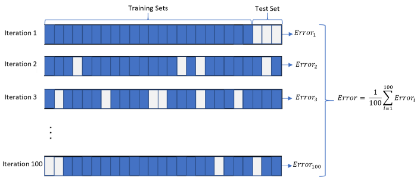

## Recap

* Network Variance problem
* Same different obs different classification

---

# Data Preprocessing

## Data Normalisation

> Order of magnitude of feature vectors are quiet different  , higher priority may be given to features with higher magnitude,

* Normalize
  * $fi = (fi - min[f])/(max[f]-min[f]) $
* Standardize
  * $fi = (fi - mean[f])/(var[f]) $
* No Normalisation

## Data Imputation

> Missing values

* Zero imputation
  * Replace all NAN values with '0'
* Mean Imputation
  * Replace all missing value with mean of corresponding feature
* Median Imputation
  * Replace missing values with median of each feature
  * Adv -  outlayers have no effect
* Correlation Imputation
  * Find correlation of each feature vector with others
  * for a given sample
    * For a missing feature , scan next available feature in the order of its correlation
    * Use Linear regression between these to correlated feature to fill mising data
  * Takes advantage of correlation between features

| f1 | f2  | f3  | f4  | .   | . | f32 | . | . | .   | . | f_n |
| -- | --- | --- | --- | --- | - | --- | - | - | --- | - | --- |
|    |     |     | nan |     |   |     |   |   |     |   |     |
|    |     |     |     |     |   |     |   |   |     |   |     |
|    | nan |     |     | nan |   |     |   |   |     |   |     |
|    |     |     |     |     |   |     |   |   |     |   |     |
|    |     | nan |     |     |   | nan |   |   | nan |   |     |
|    |     |     |     |     |   |     |   |   |     |   |     |
|    |     |     |     |     |   |     |   |   |     |   |     |

## Classifiers

To evaluate the working of these processing techniques we use different classifier algorithms

* K-nearest Neighbour
* Logistic Regression
* Fully Conneected Network
* Convolution NN
* Random Forest CLassifier

## Evolution Methodology

> Each case of combination of data-normalisation / data Imputation / Classifier algorithm were evaluated as follow :

* Entire dataset was processed through chosen algorithm , to get transformed parameter table.

### Monte-Carlo Cross validation

* Iteration (32 times) :
  * Shufle data rows
  * Split traing and test data - 0.8:trai , 0.2:test
  * Pass through the classifier
  * Store train and test accuracy

# Result

## Normalisation

> evaluated on Zero Imputation
> 

## Imputation

> Evaluated on Normalised data
> 

# Conclusion

* Across the classifier , RF have least variabiliyt and highest acuracy

## Next

* Hyper parameter tuning for RF classifier , for reducing ambiguous result
* Popular sources not in the catalogue
  * BH :
    GRS 1915+105 , XTE J1752−223 , XTE J1550-564, SLX 1746-331,cyg-x1 , MAXI-J1820-070
  * NS :
