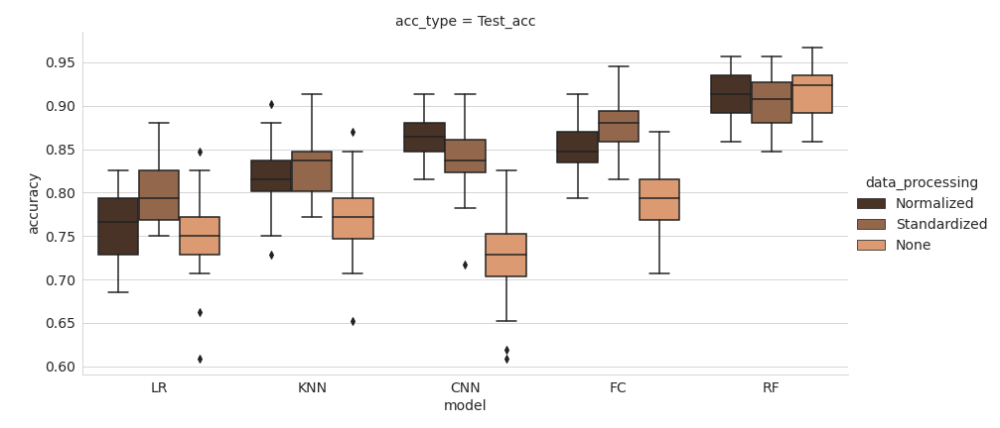
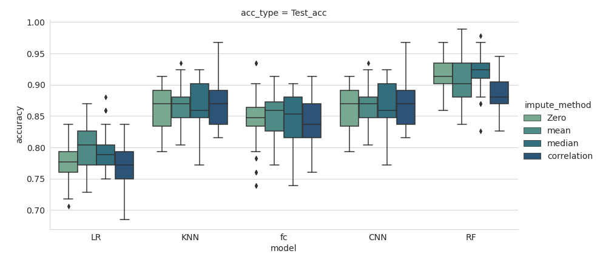
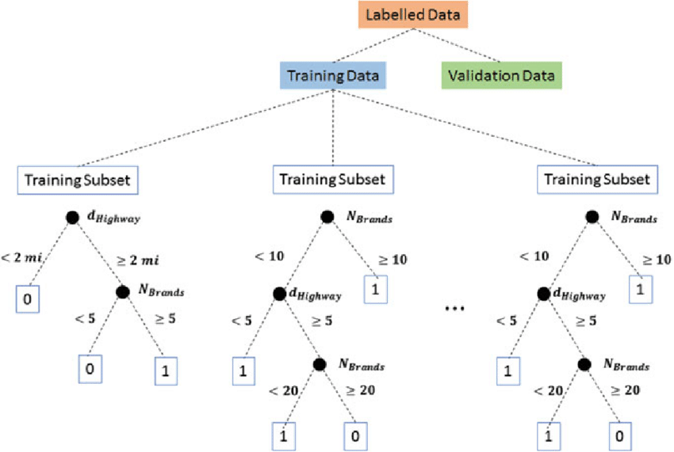
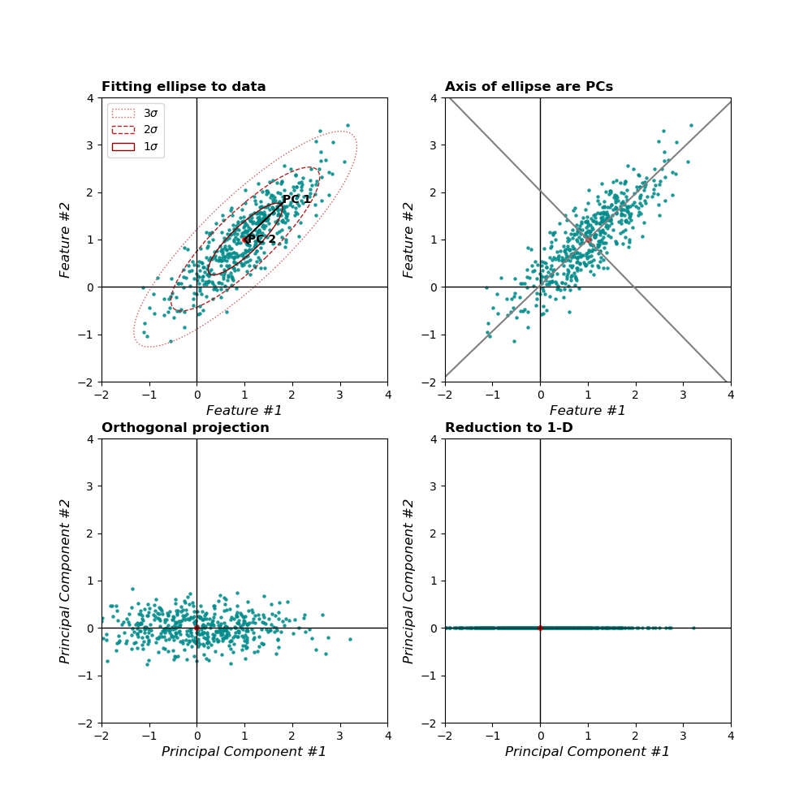
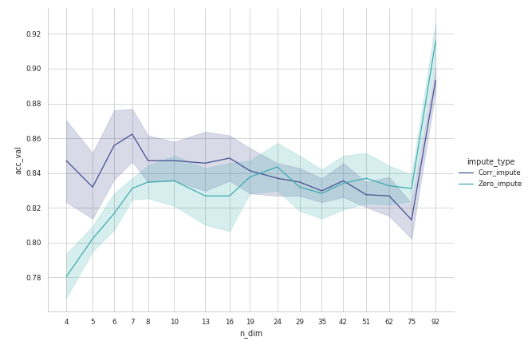
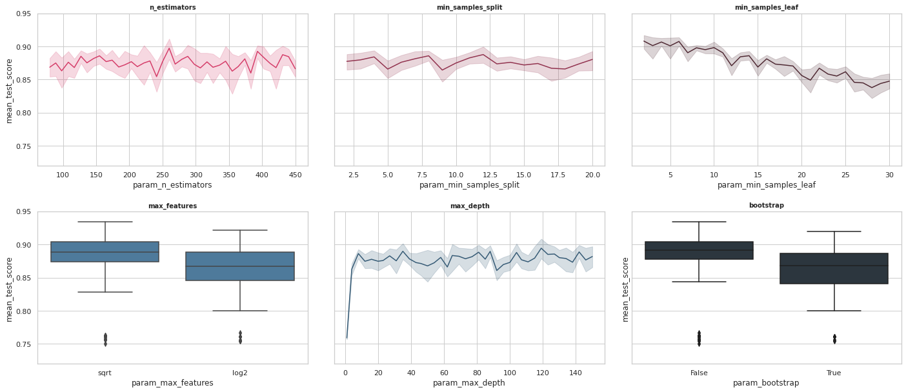
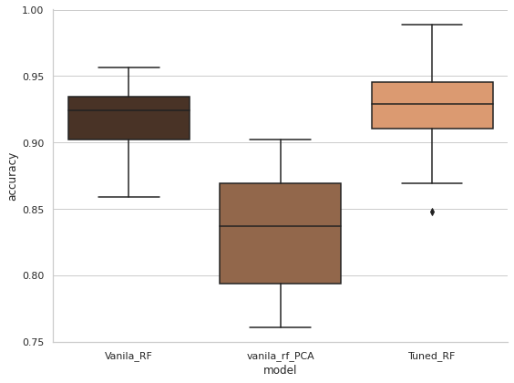
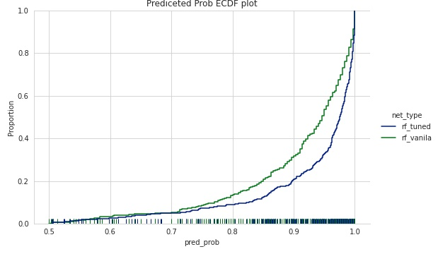
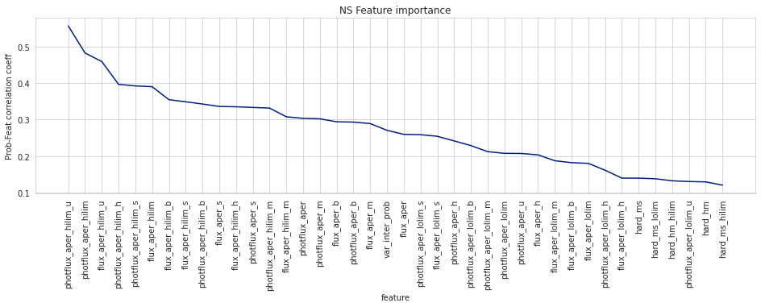
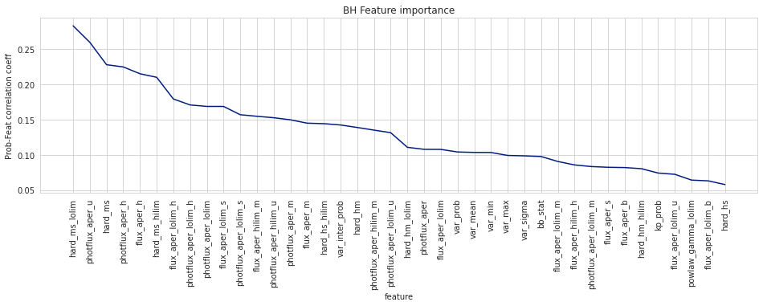

# Recap

* We had selected Data processing technique
* Identified best Network .

## Random Forest classifier

> RF Example illustration

> Does RF always works better

* Different from Neural Network or Deep learing algorithms
* RF can not do feature extraction

# PCA Dimensionality Reduction

> 
> Source : https://nextjournal.com/tempdata73/dimensionality-reduction

> Where To use dim reduction

> Where Not to use dim reduction

---

# Hyper Parameter Tuning For Random Forest

---

# Result

### Network Variance

| Param           | Vanila RF | Tuned RF |
| --------------- | --------- | -------- |
| Mean Accuracy   | 0.916     | 0.926    |
| Acc Variance    | 0.026     | 0.03     |
| Ambiguous Class | 62 / 460  | 42 / 460 |

As far as accuracy is concerned , hyperparameter tuning has not resulted in much improvement , but let's dig deeper into the probability confidence .

### Probability Quality

### Feature Importance

> NS Feature Importance

> BH Feature Importance

---

# Next

* Add CV , Isolated Pulsar