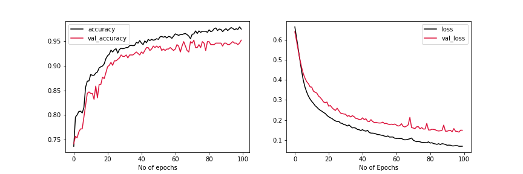
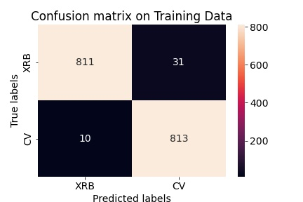
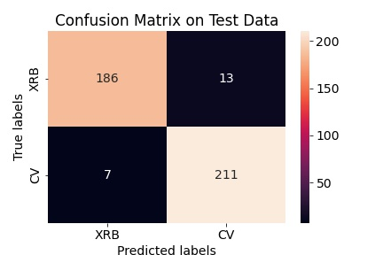
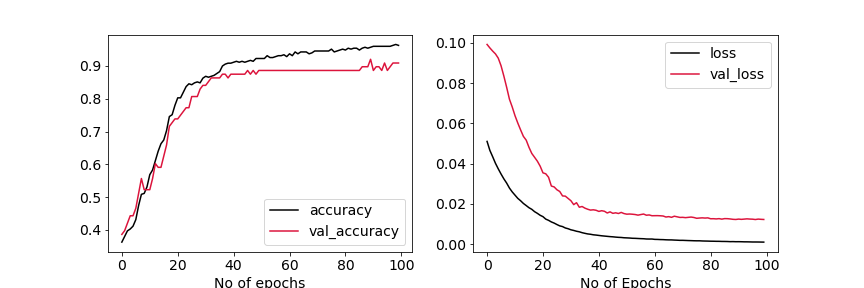
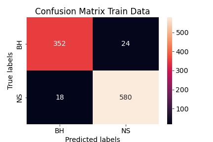
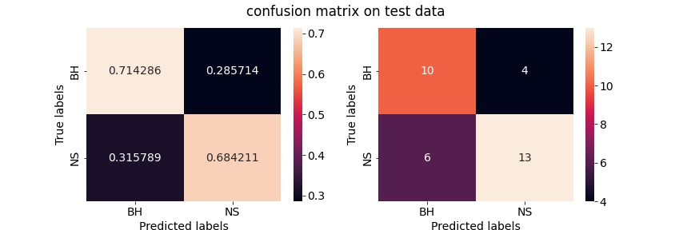
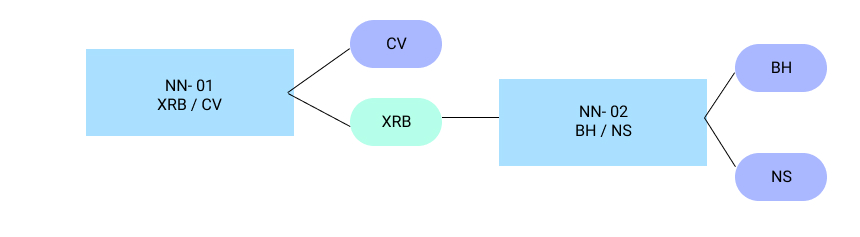
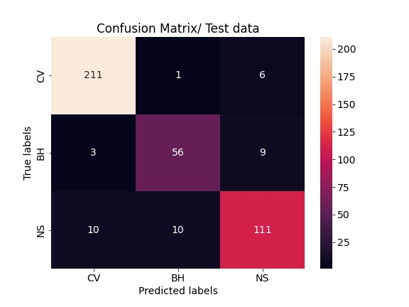

# Classification

Now that we have done analysis over globular clusters , weh know the distribution of flux from globular cluster x-ray sources , we can use that to indentify the quiscent sources , or at least say with certain confidance which sources (or which observation) are not in burst state.

We will feed only those observation for training data.

we have the confirmed classification of sources which are both in quiscent state , for those sources , we will pick out the catalogue in which observations are made when the fluxs are less than certain threshold (mean of globular cluster sources flux)

We can consider each observation as distinct source for training.

`<br><br>``<br>`

# Catalogues

<div style="display:flex;flex-direction:row;">
<pre>
CV
__________________________
GC47TUCCXO (Heinke et al.)    
XMMSLEWCLN    
M31CFCXO       
RASS2MASS      
XMMSSCLWBS     
IBISCAT        
INTREFCAT       
WGACAT          
NGC6791CXO      
CHICAGOCXO      
M31CXO2         
INTVARCAT       
INTIBISASS      
INTIBISGAL      
RASS6DFGS       
RASSUSNOID      
RBS             
M83XMM          
RASSCNDINS       
</pre>
<pre>
LMXB NEUTRON STAR
_______________________
XMMSSCLWBS    
IBISCAT       
RITTERLMXB    
INTREFCAT     
RASS2MASS     
XRBCAT        
WGACAT        
SMCWINGCXO     
SAXWFCCAT         
</pre>

<pre>
BLACK HOLE
_______________________
RITTERLMXB    (Ritter, Kolb)  
NGC3115CXO    
INTREFCAT     
XRBCAT        
WGACAT         
SAXWFCCAT      
SAXWFCCAT2      
</pre>

</div>

## Classes Taken

<div style="display:flex;flex-direction:row;">
<pre>
CV 
___________
all CV 
</pre>
<pre>
BH
___________
LMXRB BLACK HOLE +
LMXRB GLOBULAR CLUSTER BLACK HOLE
LMXRB QPO AND BLACK HOLE
</pre>
<pre>
NS
____________
LMXRB PULSAR AND BURSTS +
LMXRB QPO AND PULSARS +
LMXRB X-RAY PULSARS +
</pre>
</div>

# Data Filtering

| Filter               | criteria                 |
| -------------------- | ------------------------ |
| streak_src_flag      | False                    |
| pileup_flag          | False                    |
| mstr_streak_src_flag | False                    |
| Flux value           | <$10^{-12} erg/cm^2/s$ |
| Significance         | > 20                     |

`<br><br>``<br>`

# Final Dataset

| #                      | LMXRB BH | LMXRB NS | CV   |
| ---------------------- | -------- | -------- | ---- |
| sources                | 123      | 229      | 322  |
| Observations           | 1100     | 1268     | 3609 |
| Obs matching criterion | 824      | 971      | 2604 |

`<br><br>``<br>`

# Parameters Used

* -Log(Flux)
* Variability
* Hardness
* Model Fit
  * BB
  * Powerlaw
  * Bremsstrahlung

<br>

# Data Pre-procesing

> All Bands (b/h/m/u/s) are average combined for flux

> Dropped all empty rows and all empty columns

> $-log_{10}{flux}$ is used

> All data columns are normalised

> Data columns distributions are normalised $(x_i-mean)/var$

> Nan Values are imputed with 0 // imputation scheme can be improved

`<br><br>`

# Result

## X-ray binary (NS+BH) Vs CV



```
Training Accuracy - 97.9 %
Test Accuracy - 95.20 %
```




---

## NS vs BH



```
Training Accuracy - 96.5 %
Test Accuracy - 92.3 %
```




---

## Combined NN



> Test data

```
Total Examples - 417
----------------------
CV    218
NS    131
BH     68
```

`

# Next Execises

## Imputation

Ritght now we are imputing **Nan** values with zeros.
We tried imputation with mean values also , but that resulted in degraded accuracy. Next a better method would be this -

* [X] For every dta columns, try to find the distribution using some model (maybe-**Gaussian mixture model**) .
* [ ] Sample out the missing values from this distribution.
* [ ] Find correlation of the parameters ,
* [ ] Taking help from highly correlated parameters , fiil in the missing values

---

## Network Visualisation

> In the correlation matrix we see that some of the neutron stars are classified as BH , and vice-versa. Now since the outpuit of the network is probabilities , it may happen that for some of the exam-ples of BH , the output probability corresponfing to BH class may will be higher than some of the other BH objects classified as BH but with a lower probabilities.

Hence for a given class  , taking all the entries, the output probabilities must have certain correlation with different feature vectors.

Ok let me explain more , say consider feature - 01 , if it is highly important for identifying BH , then the probabilities corresponding to this class will be highly correlated with this feature.

> This scheme is already applied and verified for MNIST data in [[network_viz]] folder  check it out

---

## Significance

FOr now we are considering observations only above a certain thresho9ld and above that each observation are treated equally , somehow we need to definitly include significance in the training.

Idealy entries having mnore significance should have more importance in training.

### Modify Loss funciton

in loss function , for each batch , the average of losses are taken , instead we can take the weighted average of , with weight factir being significance.

---

## Same source observations

In current scenario we are considering all observations as different sources for training. Now it may happen that for a same given source different observations would be classified differently. We need to avoid this case.
somehow.

Define a vector of length equals to the number if sources , where each element correspond to each source.

After each training batch this vector somehow stores the informaiton of same source being classified differently.

If same sources are classified as same every times , the values should be zero , and each time same source - different obseravtion are classified differently (for this part we do not worry whether classification is right or wrong, that thisng is handelled by the netwrok default loss funciton) the value should increase and at the end this information needs to somehow incorporated in the loss function.

Effectively we are penalizing the different classification of same source.

> Try this out

---

## Training Data CLasity

Dig more information about all the sources we are using for training, like how the classification are initially done

---

## Unsupervised learning Cluster Method

> Try this out
