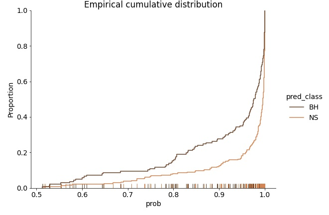
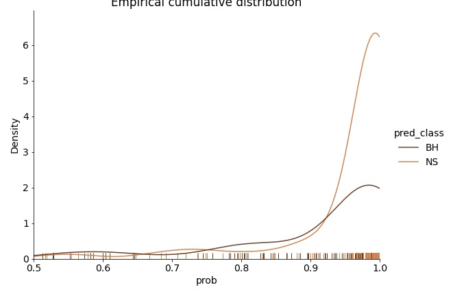
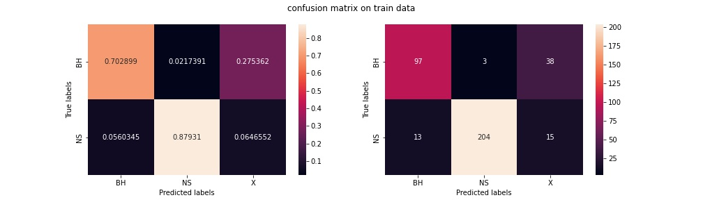
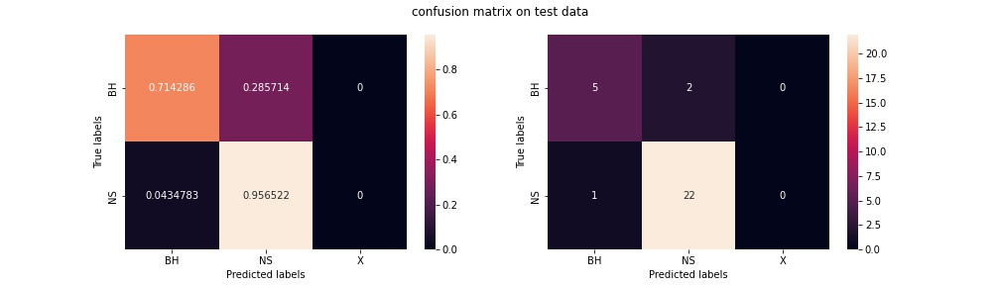
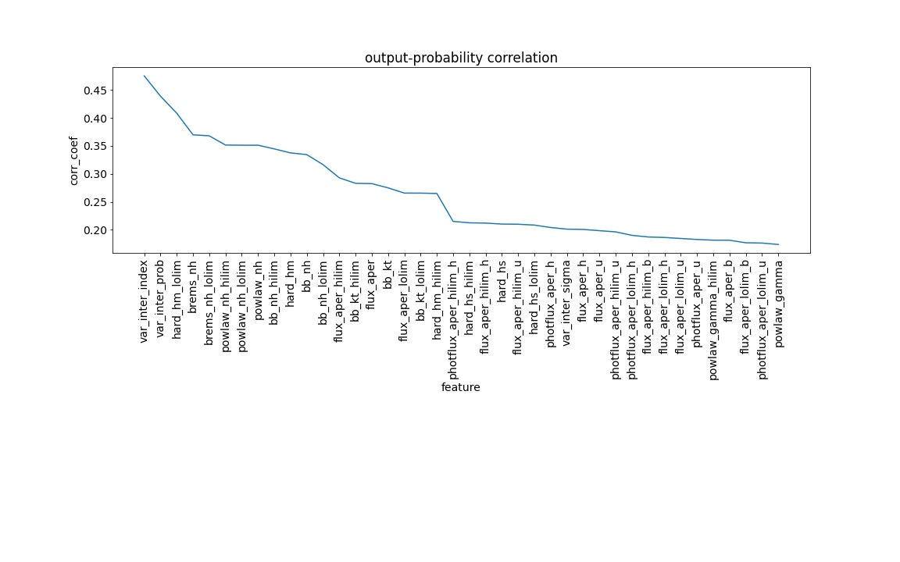
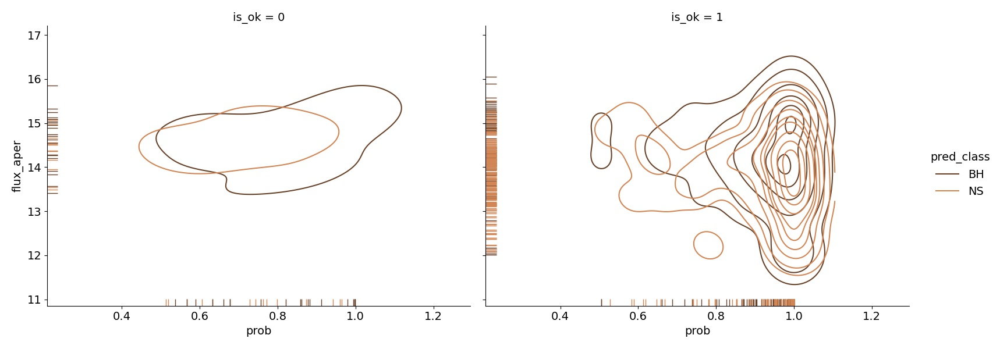
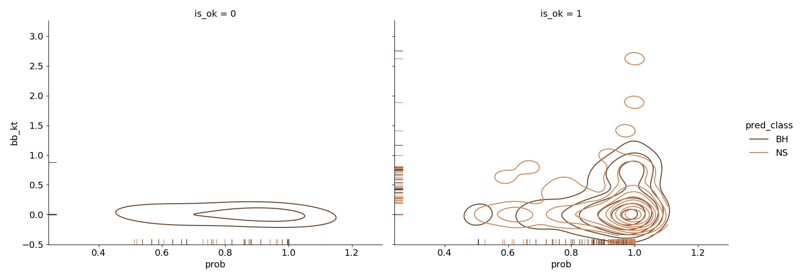

# Result Analysis

## Aim

* Probility output study
* Same Source different observation different classification issue
* CLuster of parameter correlation

---

## Probablity Output Study

For now the classification scheme is, we assign a class to a source if the output prob is more than 0.5 , but there is a fundamental problem with this approach. 0.5 prob means that next time if we predict the same source then 50 percent chances are there that the same source will be classified correctly. SO we should set a certain threshold.

### Posterior probabilities

To evaluate the perofmance of how good out netwrk is performing for certain class , we check the probability distrbution for certain class predicted class.
Density distribution of output probabilities corresponding to predicted class

> Result

> Inference

From the posterior probability distribution plot above, we see that NS curve has a steep rise about 1.0 . BH curve peaks before 1.0 and has a broader distribution. This means that 0.
Less than 80 % probability we will take as **ambiguous** case.

## Wrong Prediction cases

| FIELD1 | id     | name                 | class | correct | incorr | ambig | train_q | comments                                                                                                                                       |
| ------ | ------ | -------------------- | ----- | ------- | ------ | ----- | ------- | ---------------------------------------------------------------------------------------------------------------------------------------------- |
| 0      | BH0001 | 1A 0620-00           | BH    | 0       | 0      | 3     | chk     | this source is not ok , every time training sample is change this source is classified incorrectly                                             |
| 1      | BH0004 | GRO J1655-40         | BH    | 1       | 0      | 1     | chk     | model fit parameters are available for correct classified observation                                                                          |
| 2      | BH0009 | SAX J1819.3-2525     | BH    | 3       | 0      | 2     | chk     | reason not identified ,                                                                                                                        |
| 3      | BH0010 | XTE J1550-564        | BH    | 4       | 1      | 2     | chk     | all incorrect and ambiguous class has no modelfit params , but one of the correct pred also doesn’t have model-fit params                     |
| 4      | BH0011 | XTE J1650-500        | BH    | 0       | 1      | 0     | chk     | no model-fit params                                                                                                                            |
| 5      | BH0014 | CXOU J100506.7-07443 | BH    | 5       | 0      | 1     | chk     | All-ok , even one of the ambig obs have prob ~ 0.8                                                                                             |
| 6      | BH0018 | CXOU J100514.2-07423 | BH    | 10      | 0      | 0     | ok      |                                                                                                                                                |
| 7      | BH0019 | CXOU J100515.4-07425 | BH    | 11      | 0      | 0     | ok      |                                                                                                                                                |
| 8      | BH0020 | CXOU J100516.2-07423 | BH    | 1       | 0      | 10    | chk     | Intresting  , none of the obs has model-fit params , but one good classification has relatively more negative hm hardness                      |
| 9      | BH0021 | CXOU J100516.5-07420 | BH    | 11      | 0      | 0     | ok      |                                                                                                                                                |
| 10     | BH0022 | CXOU J100517.1-07421 | BH    | 9       | 0      | 2     | chk     | Intresting , hardness patterns is peculiar to ambiguous classification                                                                         |
| 11     | BH0023 | CXOU J100518.5-07413 | BH    | 2       | 0      | 2     | chk     | both correct class has variability index 0                                                                                                     |
| 12     | BH0024 | J1047+1234           | BH    | 5       | 0      | 0     | ok      |                                                                                                                                                |
| 13     | BH0027 | J1745-2900           | BH    | 30      | 1      | 15    | chk     | Total 46 obs, can do in-depth analysis                                                                                                         |
| 14     | BH0028 | KV UMA               | BH    | 3       | 0      | 0     | ok      |                                                                                                                                                |
| 15     | BH0029 | V404 CYG             | BH    | 2       | 0      | 0     | ok      |                                                                                                                                                |
| 16     | NS0001 | 1A 1742-289          | NS    | 10      | 0      | 0     | ok      |                                                                                                                                                |
| 17     | NS0004 | 1A 1744-361          | NS    | 1       | 0      | 0     | ok      |                                                                                                                                                |
| 18     | NS0009 | 2E 1613.5-5053       | NS    | 2       | 0      | 0     | ok      |                                                                                                                                                |
| 19     | NS0011 | 3A 2129+470          | NS    | 4       | 0      | 0     | ok      |                                                                                                                                                |
| 20     | NS0015 | 4U 2129+12           | NS    | 2       | 0      | 0     | ok      |                                                                                                                                                |
| 21     | NS0019 | EXO 0748-676         | NS    | 9       | 0      | 0     | ok      |                                                                                                                                                |
| 22     | NS0020 | EXO 1745-248         | NS    | 14      | 0      | 1     | chk     | Only 1 amb case (0.7 ), only difference is flux is relatively higher , but flux-significance is much small than other and hardness are missing |
| 23     | NS0021 | GRS 1741.9-2853      | NS    | 10      | 0      | 0     | ok      |                                                                                                                                                |
| 24     | NS0024 | H 1658-298           | NS    | 3       | 3      | 2     | chk     | ambig/wrong obs has missing model-fit params                                                                                                   |
| 25     | NS0028 | IGR J00291+5934      | NS    | 2       | 0      | 3     | chk     | all ambig have mising model-fit, but one correct also has missing params. Need to find more                                                    |
| 26     | NS0030 | IGR J17464-2811      | NS    | 1       | 0      | 0     | ok      |                                                                                                                                                |
| 27     | NS0033 | KS 1731-260          | NS    | 5       | 0      | 2     | chk     | no apparent difference                                                                                                                         |
| 28     | NS0034 | SAX J1750.8-2900     | NS    | 1       | 0      | 0     | ok      |                                                                                                                                                |
| 29     | NS0038 | SAX J1810.8-2609     | NS    | 1       | 0      | 0     | ok      |                                                                                                                                                |
| 30     | NS0042 | XB 1732-304          | NS    | 1       | 0      | 0     | ok      |                                                                                                                                                |
| 31     | NS0044 | XMMU J004245.2+41172 | NS    | 82      | 0      | 3     | chk     | Total 86 obs  , in-depth analysis needed                                                                                                       |
| 32     | NS0047 | XMMU J004414.0+41220 | NS    | 3       | 0      | 0     | ok      |                                                                                                                                                |
| 33     | NS0049 | XTE J1709-267        | NS    | 2       | 0      | 0     | ok      |                                                                                                                                                |
| 34     | NS0056 | J1748-2021#2         | NS    | 1       | 2      | 1     | chk     | classified as NS - hardness (hm) positive , classified as BH (hm) high -ve , ambiguous hardness 0                                              |
| 35     | NS0057 | J1748-2446           | NS    | 15      | 1      | 0     | chk     | Intresting , only incorrect obs has all model-fit params                                                                                       |
| 36     | NS0059 | J1749-2808           | NS    | 2       | 0      | 0     | ok      |                                                                                                                                                |
| 37     | NS0062 | J1824-2452           | NS    | 3       | 1      | 1     | chk     | no idea                                                                                                                                        |
| 38     | NS0068 | SAXWFC J1744.9-2921. | NS    | 5       | 0      | 1     | chk     | hardness is missing, but for one correct pred also hardness is missing                                                                         |
| 39     | NS0069 | SAXWFC J1747.0-2853. | NS    | 0       | 1      | 0     | chk     | Inconclusive , model-fit missing , only one obs                                                                                                |
| 40     | NS0075 | 1WGA J0514.1-4002    | NS    | 1       | 0      | 0     | ok      |                                                                                                                                                |
| 41     | NS0076 | 1WGA J0748.5-6745    | NS    | 5       | 3      | 1     | chk     | no conclusion                                                                                                                                  |
| 42     | NS0077 | 1WGA J1747.4-3002    | NS    | 0       | 2      | 0     | chk     | both are classified as BH                                                                                                                      |
| 43     | NS0078 | 1WGA J1911.2+0035    | NS    | 16      | 0      | 0     | ok      |                                                                                                                                                |
| 44     | NS0083 | E2259+587            | NS    | 1       | 0      | 0     | ok      |                                                                                                                                                |
| 45     | NS0084 | GRO J1744-28         | NS    | 2       | 0      | 0     | ok      |                                                                                                                                                |
|        |        |                      |       |         |        |       |         |                                                                                                                                                |
|        |        |                      |       |         |        |       |         |                                                                                                                                                |
| 0      | BH0003 | GINGA 1354-645       | BH    | 1       | 2      | 0     | chk     | wrong classification has model-fit parameters missing                                                                                          |
| 1      | BH0008 | IGR J17464-3213      | BH    | 3       | 0      | 0     | ok      |                                                                                                                                                |
| 2      | BH0016 | CXOU J100510.0-07452 | BH    | 1       | 0      | 0     | ok      |                                                                                                                                                |
| 3      | NS0003 | 1A 1743-288          | NS    | 0       | 1      | 0     | chk     | only one obs , mdoel-fit parameters missing                                                                                                    |
| 4      | NS0016 | CEN X-4              | NS    | 2       | 0      | 0     | ok      |                                                                                                                                                |
| 5      | NS0055 | J1748-2021#1         | NS    | 4       | 0      | 0     | ok      |                                                                                                                                                |
| 6      | NS0072 | SAXWFC J1748.1-2446. | NS    | 16      | 0      | 0     | ok      |                                                                                                                                                |

#### Observation

* Total Number of obs - 400
* Ttotal Ambiguous - 52
  * Total ambiguous classfication with missing model-fit params - 48
  * total ambiguous classification with model-fit params - 4
* Total wrong - 19
  * missing-model fit - 16
  * with model-fit - 3
* Ttotal correct pred - 328
  * missing model-fit : 252
  * with model fit - 76

#### Conslusion

Most likely reason for miss-classification is missing data , model fit paramseters are set to 0 , due to which they get lower importance and increases ambiguity. However as is so many cases evwen with missing parameters sources are confidently classified correctly so cant make this conclusion.

Also hardness seems to be a deciding factor , (more study needed)

---

## Output probability correlation

Correlation of output probabilities with individual features will give us the feaure importance.

### Example

--

## Feature-Feature correlation
