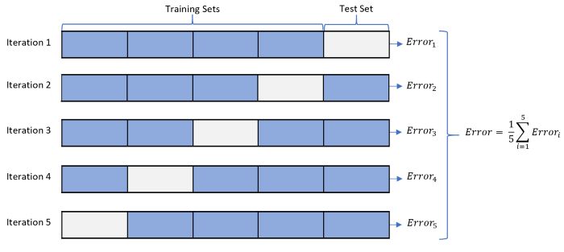
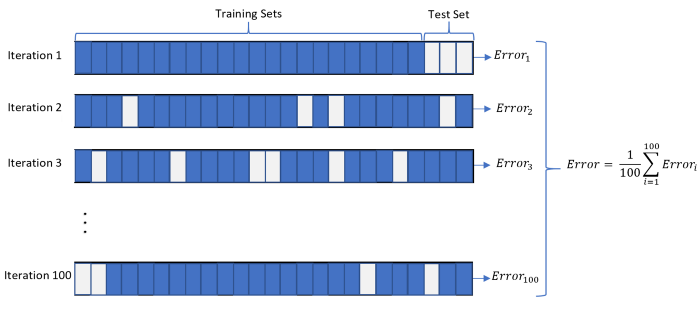
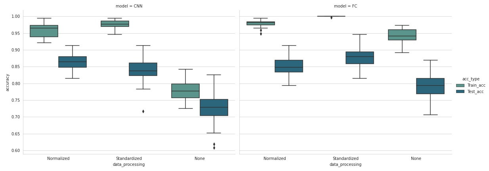
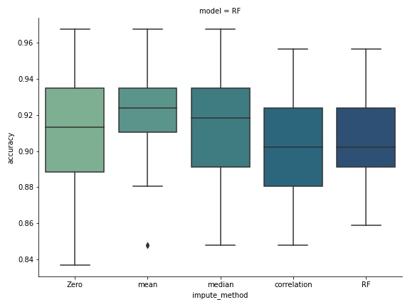

# Cross Validation 
Since Artificial neural-netowrk or any Deep learning architecture is inherently stochastic, outputs of such network is bound to have a variance.
### Source of randomness

## K-fold cross validation
    * Entire dataset is split into k- equal parts
    * k-1 parts are used for training and 1 part is usetd for validation
    * each time one distinct part is held for validation
    

Here each element of data sample gets a chance to be a test sample and k-1 chance to be trianing sample. Thus the network is tested over entire data sample.

#### Cons
* This is a exhaustive validation scheme , number of runs is limited.
* Test sample may be small , leads to high variance in test error

## Monte Carlo cross-validation
    * small subsample from dataset is selected as test sample in each iteration
    * Here individual data samples may or may not get a chance of being included in testing.
    * Non-exhaustive method , can be run for infinitely large number of iterations , thus giving an idea of better convergence

# Pretraining

Since the difference in the values of our feature vector are of the order of magnitudes , weights learnt by the network is not stable and have very high variance trainng to traing , even for the same architecture and same data sample. hence we need to preprocess the data before training. The varability of network will depend upon the kind of data processing.

---

## Data Processing methods
> Before any further processing , Log(flux columns) are taken 
* Normalisation 
    * To ensure data values are within 0-1 
    * For each x , $xi = (xi - min[x]) / (max[x]-min[x])$
* Standardisation 
    * To ensure mean = 0 , variance = 1 
    * For each x , $xi = (xi-mean[x])/var[x]$
* None 

--- 
## Data Imputation Methods
Some network architectures can handle NAN values like **Random Forest classifier** however some other arch  like **CNN** or **FC** network can not handle NAN values. In our given dataset , there are several NAN values (for example for the obs only in one band , all model fitting parameters are missing)

> Should we do data imputation before or after data normalisation , still aquestion

* Zero Imputation
    
    Fill The missing values with zeros. It can lead to wrong results as the actual true values are also closer to zero

* Mean Imputation
* Median Imputation
* Data-Fit sampling 
    
    Use Correlation with other features to fill in missing features.
    * For every feature compute correlation coefficient with other features , and fit a linear regresion model corresponding to each correlation
    * Hence for each correlation we have - 
        * Correlation coefficient
        * Linear fit parameters (m,c) : y = mx+c
    * For each given feature , for each obs , for each missing value , find the next highest correlated available feature say f_n.
    * FIll in it with f_missing  = f_n * m_n + C_n
    * May be time consuming , think of a better method
* Data FIlling NN

    Design a different neural network for filling missing values , sort of what we were doing in the last step , but automatically

---

# Networks

## Fully connected Network 

## Convolution Neural Network 
    Since we have correlation between data , the convolution would take advantage if the correlated features are put-together.
## Random Forest Classifier 

## Logistic regression 

## K- Nearest Neighbour

# Result 

Monte-Carlo cross validation is run with same dataset for all combination of data-procesing techniques with different netwrok

## Validation parameters
* Number of runs - 32
* Train-test split 0.8 / 0.2 
* Each time data is reshuffled split and model is trained and evaluated

> Note - train-test split are done considering each observation as source and not the source per se. Train-test spit as source should also be tried

## Validation result

CNN and FC

Random Forest classifier

Direct comparison between CNN and FC should not be done , because RF is an ensamble classifier (ensamble of 300 decision trees). If we make such a high ensamble of other network the variance of such networks are also expected to be smaller , but that would take forever to train.

## Observation 

## Conclusion

* Random Forest ensamble classifier is our To-GO

---
# Dimensionality Reduction 
Will do after using properdata reduction , filling and qualifying them to asses relative feature importance

> Why  : To better visualisation of whats happeinng 

---
## PCA

---
## VAE

