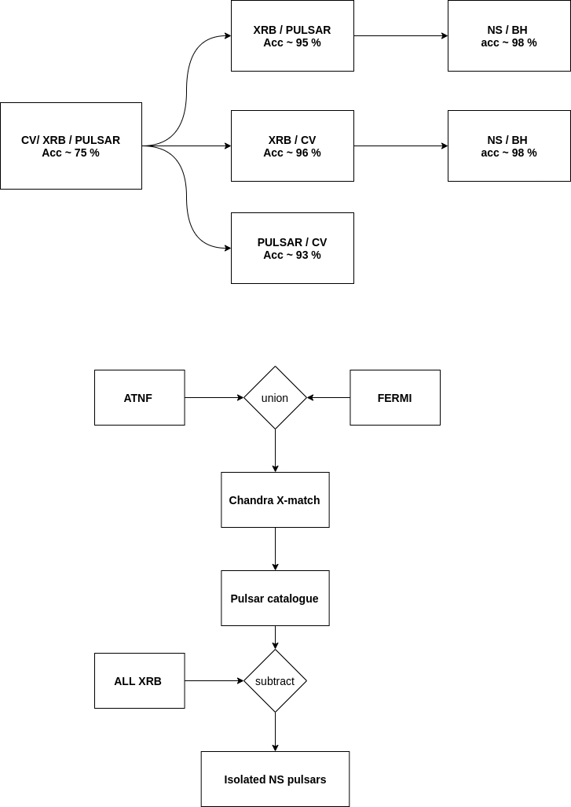

# Feature Importance 
> Accuracy with Model-fit parameters  ~ 98 % 

> Accuracy without model-fit parameters ~ 85 %

* Need a better qualifier for reature importance 

# Pulsar Catalogue 

## ATNF Catalogue - 

* **AXP**	Anomalous X-ray Pulsar or Soft Gamma-ray Repeater with detected pulsations
* **BINARY**	Pulsar has one or more stellar companion(s)
* **HE**	Spin-powered pulsar with pulsed emission from radio to infrared or higher frequencies
* **NRAD**	Spin-powered pulsar with pulsed emission only at infrared or higher frequencies
* **RADIO**	Pulsars with pulsed emission in the radio band
* **RRAT**	Pulsars with intermittently pulsed radio emission
* **XINS**	Isolated neutron stars with pulsed thermal X-ray emission but no detectable radio emission

### Considered classes 
    AXP 
    HE
    NRAD
    XINS 

## Fermi LAT Second Catalog of Gamma-Ray Pulsars (2PC)

--- 

Number of sources (Pulsars) - 138 sources 

In binary -  36 

Isolated -  102 

Filtered (sat , pile-up , streak, flux) - 93

In Globular cluster - 1 (in terzan -4 )
---

# Classifier 

### Result 

    Num of CV sources : 65
    Num of CV obs : 515
    Num of LMXRB sources : 75
    Num of LMXRB obs : 460
    Num of PULSAR sources : 93
    Num of PULSAR obs : 206
---

    Total samples 1181
    Ambiguous calssification :  34
    Wrong calssification :  16
    Classification accuracy :0.958

## Problems 
 > Flux filter 