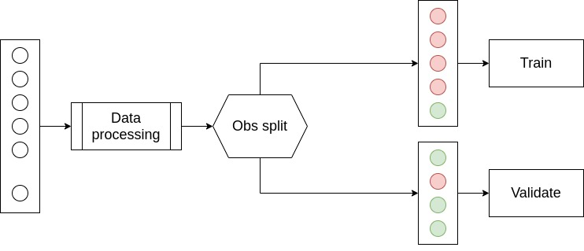
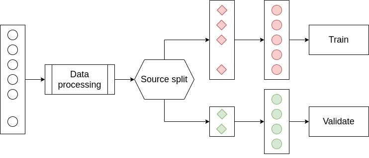
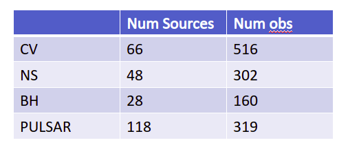
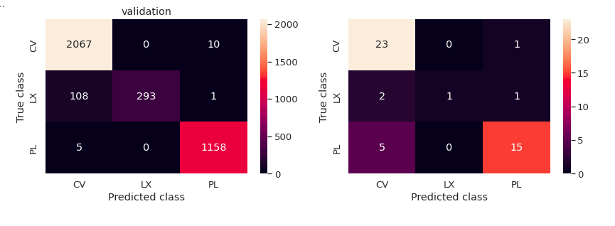
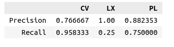

# Recap

> For LMXB / PULSAR / CV , claimed validation accuracy ~ 85 %

> Had to apply to New source

# Problem

> Validation accuracy - $85\pm 2$ %

> Validation accuracy - $45\pm 2$ %

##

* Problem with data imputation
* Data-set very small

# Tried Solutions

> Instead of data-imputation all at once , do source-wise imputation

> Use Ensamble classifier approach -  **XGBoost**

## ADAboost

> Increse data-set

## Dataset

* **Heasarc** CV dataset is very small .
* Used Open-cataclsmic variable catalogue
* Used all sources from ATNF catalogue (ATNF have only rotation powered pulsar sources)

## CV catalogue

<i>The Open Cataclysmic Variable Catalog ( Ryan Jackim et al 2020 Res. Notes AAS 4 219)</i>

> Total Number of sources ~ 12,000

> Cross matched with chandra - 605

> Total Number of obs - 2101|   |   |   |

| col1                              | CV         | Pulsar  |
| --------------------------------- | ---------- | ------- |
| Total number of sources           | ~ 12 , 000 | ~ 3,000 |
| cross matched with chandra (10'') | 634        | 264     |
| Num of obs                        | 2101       | 1183    |

# Result

